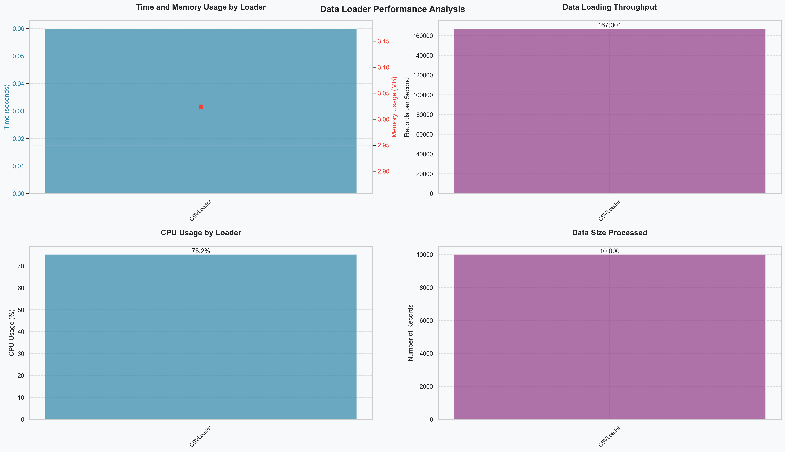

# DataVolt: Enterprise Data Pipeline Framework

<p align="center">
  
</p>


[](https://github.com/DarkStarStrix/DataStream/actions/workflows/Tests.yml)

## Introduction

DataVolt is an enterprise-grade framework for building and maintaining scalable data engineering pipelines.
It provides a comprehensive suite of tools for data ingestion, transformation, and processing,
enabling organizations to standardize their data operations and speed up development cycles.

## Core Capabilities

DataVolt delivers three primary value propositions:

1. **Pipeline Standardization**: Unified interfaces for data ingestion, transformation, and export operations
2. **Operational Efficiency**: Automated workflow orchestration and preprocessing capabilities
3. **Enterprise Integration**: Native support for cloud storage, SQL databases, and machine learning frameworks

## Technical Architecture

```
DataVolt/
├── loaders/           # Data Ingestion Layer
│   ├── __init__.py
│   ├── csv_loader.py  # CSV Processing Engine
│   ├── sql_loader.py  # SQL Database Connector
│   ├── s3_loader.py   # Cloud Storage Interface
│   └── custom_loader.py # Extensibility Framework
├── preprocess/        # Data Transformation Layer
│   ├── __init__.py
│   ├── cleaning.py    # Data Cleansing Engine
│   ├── encoding.py    # Feature Encoding Module
│   ├── scaling.py     # Normalization Framework
│   ├── feature_engineering.py # Feature Generation Engine
│   └── pipeline.py    # Pipeline Orchestrator
└── ext/               # Extension Layer
    ├── logger.py      # Logging Framework
    └── custom_step.py # Custom Pipeline Interface
```

## Installation

Install via pip:
```bash
pip install datavolt
```

For improved dependency management:
```bash
uv install datavolt
```

## Implementation Guide

### Data Ingestion
```python
from datavolt.loaders.csv_loader import CSVLoader

# Initialize data ingestion pipeline
loader = CSVLoader(file_path="data.csv")
dataset = loader.load()
```

### Data Transformation
```python
from datavolt.preprocess.pipeline import PreprocessingPipeline
from datavolt.preprocess.scaling import StandardScaler
from datavolt.preprocess.encoding import OneHotEncoder

# Configure transformation pipeline
pipeline = PreprocessingPipeline([
    StandardScaler(),
    OneHotEncoder()
])

# Execute transformations
processed_dataset = pipeline.run(dataset)
```

### Model Integration
```python
from datavolt.model.trainer import ModelTrainer
from datavolt.model.evaluator import Evaluator
from datavolt.model.model_export import ModelExporter

# Initialize model training
trainer = ModelTrainer(
    model="random_forest",
    parameters={"n_estimators": 100}
)

# Train and evaluate
model = trainer.train(processed_dataset, labels)
metrics = Evaluator().evaluate(model, test_data, test_labels)

# Export for production
ModelExporter().save(model, "models/random_forest.pkl")
```

## Enterprise Applications

DataVolt is designed for organizations requiring:

- Standardized data preprocessing workflows
- Scalable machine learning pipelines
- Reproducible feature engineering processes
- Integration with existing data infrastructure

## Contributing

We welcome contributions from the community. Please follow these steps:

1. Fork the repository
2. Create a feature branch (`git checkout -b feature/enhancement`)
3. Commit changes (`git commit -am 'Add enhancement'`)
4. Push to branch (`git push origin feature/enhancement`)
5. Open a Pull Request

## License

DataVolt is distributed under the MIT License. See `LICENSE` for details.

## Support

- Documentation: [DataVolt Docs](Writerside/topics/starter-topic.md)
- Issue Tracking: [GitHub Issues](https://github.com/DarkStarStrix/DataVolt/issues)
- Professional Support: Contact [allanw.mk@gmail.com](mail%20to:allanw.mk@gmail.com)

---

Performance Benchmark Report


Generated on: 2025-01-21 12:15:12
Number of runs per loader: 3

Loader: CSVLoader
------------------------------
Time Taken: 0.06-second
Memory Used: 3.02 MB
CPU Usage: 75.2%
Throughput: 167,002 records/second
Data Size: 10,000 records

Performance Metrics:
- Memory efficiency: 3,307.49 records/MB
- Processing speed: 0.01 ms/record





*DataVolt: Empowering Data Engineering Excellence*
